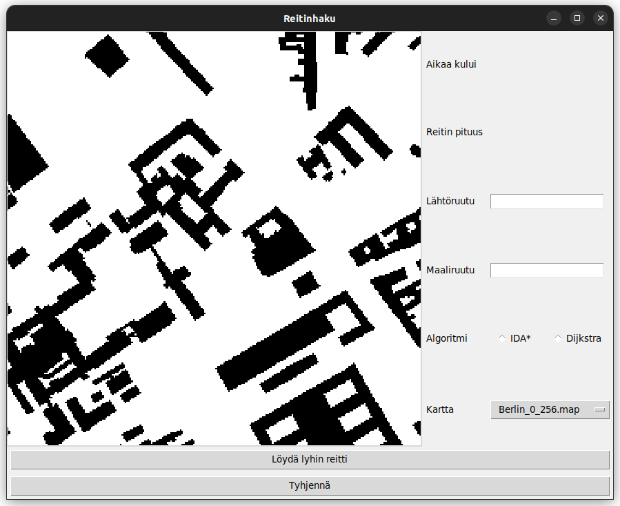
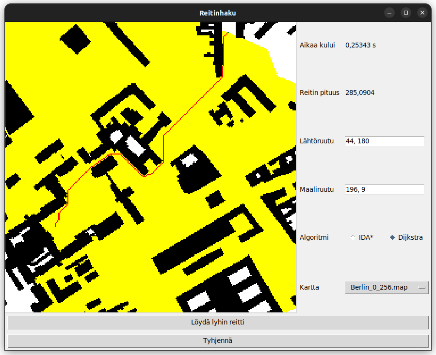

# Käyttöohje

Sovellus löytää kartalta lyhimmän reitin kahden pisteen välillä. Ohjelman avulla voidaan myös vertailla kahden reitinhakualgoritmin – IDA\*-algoritmin ja Dijkstran algoritmin – tehokkuutta.

## Vaaditut ohjelmistot

* [Python](https://www.python.org/downloads/) (versio 3.8.10 tai uudempi)
* [Poetry](https://python-poetry.org/)
* [tkinter-kirjasto](https://docs.python.org/3/library/tkinter.html) (jos ei ole asentunut Pythonin mukana)

## Asennus

Aloita lataamalla sovelluksen lähdekoodi [zip-tiedostona](https://github.com/valtterikantanen/tiralabra/releases/tag/loppupalautus) tai kloonaa projekti komennolla

```bash
$ git clone https://github.com/valtterikantanen/tiralabra.git
```
Tämän jälkeen mene projektin juurihakemistoon ja asenna tarvittavat kirjastot komennolla
```
$ poetry install
```

## Käynnistäminen

Käynnistä ohjelma juurihakemistossa komennolla
```
$ poetry run invoke start
```
Komennon tulisi avata seuraava näkymä:



## Käyttö

Lähtöruudun voi valita joko klikkaamalla haluttua kohtaa kartalta hiiren **vasemmalla** painikkeella tai kirjoittamalla ruudun koordinaatit Lähtöruutu-kenttään. Vastaavasti maaliruutu valitaan joko klikkaamalla haluttua kohtaa kartalta hiiren **oikealla** painikkeella tai kirjoittamalla ruudun koordinaatit Maaliruutu-kenttään. Koordinaatit tulee kirjoittaa niin, että x- ja y-koordinaatit on erotettu pilkulla (esim. `8, 17`). Välilyönti ei ole pakollinen. Koordinaatit on asetettu niin, että origo eli kohta (0, 0) on kartan vasemmassa yläkulmassa.

Seuraavaksi tulee valita algoritmeista toinen. Huomaa, että IDA\* voi olla hidas suurilla kartoilla tai silloin, jos esteitä on paljon ja reitti linnuntietä on todellista lyhintä reittiä paljon lyhyempi.

Tämän jälkeen klikataan painiketta "Löydä lyhin reitti". Kun lyhin reitti on löytynyt, näkymä muuttuu seuraavasti:



Tästä esimerkistä huomataan, että lyhin reitti on pituudeltaan noin 285 yksikköä ja reitin löytäminen kesti noin 0,25 sekuntia. Pituus on laskettu niin, että kunkin ruudun pituus ja leveys on 1. Näin ollen vinosuuntaisen siirtymän pituus on $\sqrt{2}$.

Reitin alku- ja loppupiste on merkitty vihreällä, reitti punaisella ja muut tutkitut ruudut keltaisella. Huomaa, että IDA\*-algoritmissa vierailtuja solmuja ei talleteta, joten niitä ei myöskään voida esittää.

Käytettävän kartan voi valita pudotusvalikosta kohdasta "Kartta". Listassa näkyvät kaikki hakemiston `src/maps/` tiedostot, joilla on tiedostopääte `.map`. Karttoja voi näin ollen myös luoda itse lisää ottamalla mallia olemassaolevista kartoista.

Klikkaamalla "Tyhjennä" näkymä vaihtuu takaisin aloitusnäkymään. Jos samasta kartasta haluaa etsiä useamman reitin, tyhjentäminen ei ole välttämätöntä. On myös mahdollista valita kartasta klikkaamalla uusi alku- tai päätepiste, mikä samalla palauttaa kartan alkutilanteeseensa. Uudet alku- ja päätepisteet on mahdollista valita myös kirjoittamalla, mutta huomioi, että tällöin ne päivittyvät karttaan vasta, kun "Löydä lyhin reitti"-painiketta painetaan.