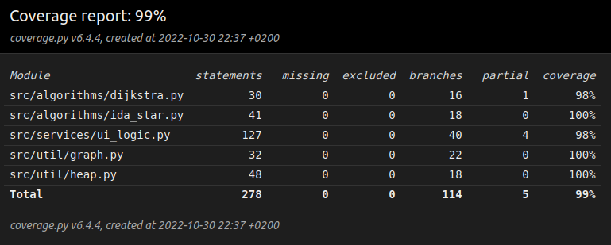

# Testausdokumentti

## Yksikkötestaus
Yksikkötestit voidaan suorittaa helposti käyttämällä [Pytest-sovelluskehystä](https://docs.pytest.org/en/7.1.x/). Testitiedostot sijaitsevat hakemistossa [`src/tests/`](https://github.com/valtterikantanen/tiralabra/blob/master/src/tests/). Yksikkötestit voi suorittaa projektin juurihakemistossa komennolla
```
poetry run invoke test
```
ja testikattavuusraportin voi generoida komennolla
```
poetry run invoke coverage-report
```

Yksikkötestausta on tehty:
* [Heap](https://github.com/valtterikantanen/tiralabra/blob/master/src/util/heap.py/)-luokalle, joka toteuttaa Dijkstran algoritmissa vaadittavan minimikeon
* [graph.py](https://github.com/valtterikantanen/tiralabra/blob/master/src/util/graph.py/)-tiedostolle, joka sisältää tarvittavat toiminnot tekstimuotoisten karttojen muuttamiseksi vieruslistamuotoon
* [dijkstra.py](https://github.com/valtterikantanen/tiralabra/blob/master/src/algorithms/dijkstra.py/)-tiedostolle, joka sisältää toteutuksen Dijkstran algoritmille
* [ida_star.py](https://github.com/valtterikantanen/tiralabra/blob/master/src/algorithms/ida_star.py/)-tiedostolle, joka sisältää toteutuksen IDA\*-algoritmille
* [ui_logic.py](https://github.com/valtterikantanen/tiralabra/blob/master/src/services/ui_logic.py/)-tiedostolle, joka sisältää käyttöliittymäkoodin

### Testikattavuus

Sovelluksen testikattavuus näyttää seuraavalta:



Sovelluksen testauksen haaraumakattavuus on näin ollen 99 %. Testikattavuuden ulkopuolelle on jätetty käyttöliittymäkoodin sisältävä hakemisto `src/ui/` ja testaukseen käytettävän koodin sisältävä hakemisto `src/tests/` sekä tiedostot `__init__.py` ja `index.py`.

## Suorituskykytestaus

Alla olevissa vertailuissa on arvottu tietty määrä satunnaisia reittejä, jotka ovat olleet samoja molemmille algoritmeille.

### Testien toistaminen

Testit voidaan toistaa projektin juurihakemistossa komennolla
```
poetry run invoke perf-test
```
Testien tulokset tulostetaan terminaaliin sitä mukaa kuin ne valmistuvat. Jos toistomääriä haluaa muokata, se onnistuu päivittämällä [main_perf_test.py-tiedostoa](../src/tests/performance_tests/main_perf_test.py).

### Tyhjä 10×10-kokoinen kartta


Kartassa tutkittiin 50 kappaletta 10 000 reitin sarjoja. Alla olevan taulukon ajat ovat siis 10 000 reitin löytämiseen käytettyjä aikoja.

| Algoritmi | Nopein      | Hitain      | Keskiarvo   | Mediaani    |
| --------- | ----------- | ----------- | ----------- | ----------- |
| Dijkstra  | 0,0132916 s | 0,0176356 s | 0,0155179 s | 0,0155268 s |
| IDA\*     | 0,0013673 s | 0,0019615 s | 0,0016281 s | 0,0016195 s |

Ajoista huomataan, että IDA\* oli kaikissa tilanteissa hitaimmillaankin yli 5 kertaa Dijkstraa nopeampi. Molemmilla algoritmeilla nopeimpaan ja hitaimpaan sarjaan käytetyt ajat eroavat suhteellisen vähän toisistaan: hitaimpaan sarjaan kului 33–43 % enemmän aikaa.

### Vain vähän esteitä sisältävä 10×10-kokoinen kartta


Kartassa tutkittiin 50 kappaletta 10 000 reitin sarjoja. Alla olevan taulukon ajat ovat siis 10 000 reitin löytämiseen käytettyjä aikoja.

| Algoritmi | Nopein      | Hitain      | Keskiarvo   | Mediaani    |
| --------- | ----------- | ----------- | ----------- | ----------- |
| Dijkstra  | 0,0095181 s | 0,0129201 s | 0,0115847 s | 0,0115386 s |
| IDA\*     | 0,0030134 s | 0,0099306 s | 0,0056182 s | 0,0051652 s |

Ajoista huomataan, että IDA\* oli keskimäärin noin 52 % nopeampi kuin Dijkstra. Dijkstran algoritmi oli kaikissa tilanteissa nopeampi kuin ensimmäisessä testissä, mikä selittynee sillä, että esteiden takia kaaria on vähemmän ja näin ollen ne voidaan käydä nopeammin läpi.

Dijkstran algoritmilla nopeimpaan ja hitaimpaan sarjaan käytetyt ajat eroavat edelleen suhteellisen vähän toisistaan: hitaimpaan sarjaan kului 36 % enemmän aikaa. Sen sijaan IDA\*-algoritmissa suoritusajat alkoivat vaihdella enemmän: hitain sarja vei noin 230 % enemmän aikaa.

### Vain vähän esteitä sisältävä 20×20-kokoinen kartta


Kartassa tutkittiin 20 000 reittiä. Alla olevan taulukon ajat ovat yhden reitin löytämiseen käytettyjä aikoja.

| Algoritmi | Nopein      | Hitain       | Keskiarvo   | Mediaani    |
| --------- | ----------- | ------------ | ----------- | ----------- |
| Dijkstra  | 0,0000253 s | 0,0023105 s  | 0,0006759 s | 0,0006729 s |
| IDA\*     | 0,0000024 s | 14,5572371 s | 0,0041142 s | 0,0000417 s |

IDA\*-algoritmilla tutkituista reiteistä meni eniten aikaa ruudusta (2, 0) ruutuun (17, 19) kulkevan reitin löytämiseen. Pisteet on merkitty kuvaan vihreällä.

Dijkstran algoritmi oli jälleen kaikissa tilanteissa nopeampi kuin edellisessä testissä, vaikka kartta onkin suurempi.

Kun tarkastellaan mediaanitapausta, IDA\*-algoritmilla suoritus kesti vain noin 6 % siitä, mitä Dijkstran algoritmilla. Keskimäärin IDA\* on siis edelleen nopea. Dijkstran algoritmilla hitain tapaus vei yli 90 kertaa enemmän aikaa kuin nopein tapaus, ja IDA\*-algoritmilla hitain tapaus vei yli 6 miljoonaa kertaa enemmän aikaa kuin nopein tapaus. Algoritmin valinnalla voidaan siis optimoida joko nopeinta keskimääräistä suoritusaikaa tai varmuutta siitä, että hitainkin tapaus vie korkeintaan sekunnin tuhannesosia.

### Kohtalaisesti esteitä sisältävä 20×20-kokoinen kartta


Kartassa tutkittiin 20 000 reittiä. Alla olevan taulukon ajat ovat yhden reitin löytämiseen käytettyjä aikoja.

| Algoritmi | Nopein      | Hitain        | Keskiarvo   | Mediaani    |
| --------- | ----------- | ------------- | ----------- | ----------- |
| Dijkstra  | 0,0000255 s | 0,0022547 s   | 0,0005928 s | 0,0005982 s |
| IDA\*     | 0,0000024 s | 324,7890677 s | 0,1860766 s | 0,0000639 s |

IDA\*-algoritmilla tutkituista reiteistä meni eniten aikaa ruudusta (19, 1) ruutuun (1, 15) kulkevan reitin löytämiseen. Pisteet on merkitty kuvaan vihreällä.

Dijkstran algoritmi oli keskimäärin hieman nopeampi kuin edellisessä kartassa. Vaikuttaa siis siltä, että esteiden määrän kasvattaminen tässäkin tapauksessa nopeuttaa reitin löytämistä.

Mediaanitapauksessa IDA\*-algoritmilla suoritus kesti vain noin 11 % siitä, mitä Dijkstran algoritmilla. Keskimäärin IDA\* on siis edelleen nopea. Dijkstran algoritmilla hitain tapaus vei jälleen noin 88 kertaa enemmän aikaa kuin nopein tapaus, ja IDA\*-algoritmilla hitain tapaus vei yli 135 miljoonaa kertaa enemmän aikaa kuin nopein tapaus. Algoritmin valinnalla voidaan siis optimoida joko nopeinta keskimääräistä suoritusaikaa tai varmuutta siitä, että hitainkin tapaus vie korkeintaan sekunnin tuhannesosia.

### Muu suorituskykytestaus

Dijkstran algoritmin toimintaa testattiin myös 930 eri syöttellä 256×256-kokoisessa kartassa. Kaikissa tapauksissa ohjelma löysi oikean lyhimmän reitin. Testaus tehtiin [esimerkkiskenaarioiden](https://github.com/valtterikantanen/tiralabra/blob/master/src/maps/Berlin_0_256.map.scen) avulla. 930 eri testitapauksen ajo kesti 168 sekuntia eli yhdessä tapauksessa kului aikaa keskimäärin 0,180 sekuntia. Nämä testit voidaan toistaa projektin juurihakemistossa komennolla
```
poetry run invoke dijkstra-test-all
```
Testauksen yhteydessä tämän projektin antamaa tulosta verrataan skenaariotiedostossa mainittuun etäisyyteen. Testi on asetettu menemään läpi, jos etäisyydet ovat kuuden desimaalin tarkkuudella samat.